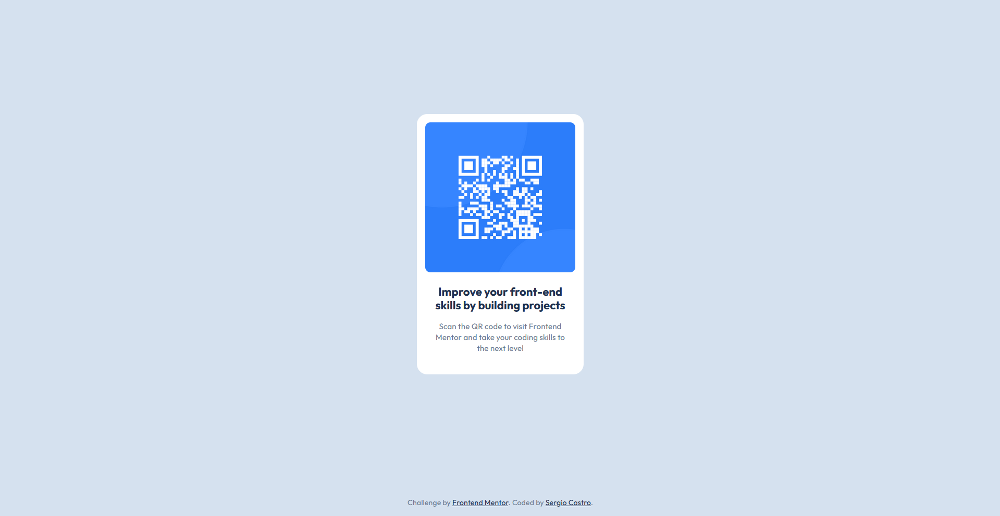

# Frontend Mentor - QR code component solution

This is a solution to the [QR code component challenge on Frontend Mentor](https://www.frontendmentor.io/challenges/qr-code-component-iux_sIO_H). Frontend Mentor challenges help you improve your coding skills by building realistic projects.

## Table of contents

- [Overview](#overview)
  - [Screenshot](#screenshot)
  - [Links](#links)
- [My process](#my-process)
  - [Built with](#built-with)
- [Author](#author)

## Overview

### Screenshot

### Links

- Solution URL: [GitHub](https://github.com/SergioCasCeb/qr-code-component)
- Live Site URL: [Netlify](https://fm-qr-challenge-sergio.netlify.app/)

## My process

1. Analyze the design guidelines
2. Implement my CSS reset code
3. Add all the root/global values as well as any utility class I might need
4. create the structure in the html files (utilizing the BEM methodology)
5. add the section/component specific styling

### Built with

- Semantic HTML5 markup
- CSS custom properties
- Scss
- Flexbox

## Author

- Website - [Sergio Eduardo Castro Ceballos](https://sergiocas.com/)
- Frontend Mentor - [@SergioCasCeb](https://www.frontendmentor.io/profile/SergioCasCeb)
- LInkedIn- [Sergio Eduardo Castro Ceballos](www.linkedin.com/in/sergio-eduardo-castro-ceballos)
